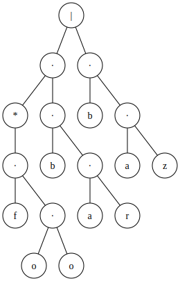

[](https://github.com/tkarabela/regex-automata/actions)
[](https://app.codecov.io/github/tkarabela/regex-automata)
[](https://github.com/tkarabela/regex-automata/actions)

# regex-automata

A toy implementation of regular expressions using finite automata. Its API is modeled after
the standard `re` module, so it can be used as a drop-in replacement (not all `re` features
are supported, though, and it behaves differently in edge cases).

Intended as a white-box implementation, it gives full tracing output for parsing and matching.
Diagrams of abstract syntax tree and the automaton are also available.

## Usage

```python
import regex_automata
import logging

logging.basicConfig(level=logging.INFO)             # show verbose output

pattern = regex_automata.compile(r"(foo)*bar|baz")  # regex_automata.Pattern

m = pattern.fullmatch("foofoobar")                  # regex_automata.Match
pattern.fullmatch("foo")                            # None

pattern.ast                                         # regex_automata.parser.ast.AstNode
pattern.raw_ast                                     # regex_automata.parser.ast.AstNode
pattern.nfa                                         # regex_automata.automata.nfa.NFA

pattern.render_ast("regex_ast.svg")
pattern.render_ast("regex_ast_raw.svg", raw=True)
pattern.render_nfa("regex_nfa.svg")

pattern2 = regex_automata.compile(r"[a-z_-][a-z0-9_-]*", regex_automata.IGNORECASE)
pattern2.tokens
# [CharacterSet(span=(0, 7), text='[a-z_-]', set=RangeSet(((45, 46), (95, 96), (97, 123)))),
#  CharacterSet(span=(7, 17), text='[a-z0-9_-]', set=RangeSet(((45, 46), (48, 58), (95, 96), (97, 123)))),
#  Repetition(span=(17, 18), text='*', min=0, max=None)]
```

Abstract syntax tree of `"(foo)*bar|baz"` (ie. `pattern.ast`):



Finite automaton accepting `"(foo)*bar|baz"` (ie. `pattern.nfa`):


## Features compared to standard `re` module

`regex-automata` is generally compatible with `re` - features either work as intended or
fail with `regex_automata.errors.UnsupportedSyntaxError`. In some edge cases, results differ:
most notably when there are multiple greedy quantifiers next to each other.

`regex-automata` passes 286/305 [`re` pattern tests](https://github.com/python/cpython/blob/main/Lib/test/re_tests.py),
with additional 98 tests ignored due to testing unsupported features.

- Library
  - `match()`, `fullmatch()`, `search()`, `finditer()`, `sub()`, `subn()` methods
  - `Match` object containing span, matched text and groups
  - flags `DOTALL`, `IGNORECASE` and `MULTILINE`

- Syntax
  - character sets: `.`, `[...]` (special sequences such as `\w` are supported, but not inside square brackets)
  - repetition: `*`, `?`, `+`, `{n,k}`
  - boundary assertions: `^`, `$`, `\b`, `\B`, `\A`, `\Z`
  - groups: `(...)`, `(?:...)`, `(?P<name>...)`
  - inline flags eg. `(?i)`
  - comments `(?#...)`

- Notable features that are _not_ supported by this library but are in standard `re`:
  - backreferences in patterns (`\1`, `\g<1>` etc.)
  - lookahead/lookbehind assertions (`(?=...)`, `(?!...)`, `(?<=...)`, `(?<!...)`)
  - non-greedy and possessive repetition (`*?`, `*+`, etc.)
  - `bytes` support
  - `UNICODE` flag, non-ASCII meaning for `\d` etc.

## Implementation overview

- Input pattern is tokenized via `regex_automata.parser.tokenizer.Tokenizer`
  - Characters and sets are represented with `regex_automata.automata.rangeset.RangeSet`
- List of tokens is processed by recursive descent parser `regex_automata.parser.parser.Parser`
- Parser produces "raw" abstract syntax tree composed of `regex_automata.parser.ast.AstNode` nodes
- AST is processed with `regex_automata.parser.ast_processor.ASTProcessor` to produce the final tree
  - This is used to replace fancy repetition with primitives (union, concatenation, iteration)
- Epsilon-free NFA is recursively constructed from the AST using `regex_automata.regex.nfa_builder.NFABuilder`
- The processed pattern is stored in `regex_automata.regex.pattern.Pattern`, which is the high-level interface
- When processing input text, the text and NFA are passed to `regex_automata.regex.nfa_evaluator.NFAEvaluator`
- The evaluator produces `regex_automata.regex.match.Match` objects

## Grammar

The recursive descent parser uses the following LL(1) grammar:

```
 1.  E  → F E'
 2.  E' → | E
 3.  E' → ε
 4.  F  → G F'
 5.  F' → G F'
 6.  F' → ε
 7.  G  → H G'
 8.  G' → *
 9.  G' → ε
10.  H  → ( E )
11.  H  → a                     (a character or character set)
12.  E  → ε
13.  F  → ε
14.  H  → boundary_assertion    (one of: ^, $, \A, \Z, \b, \B)
```

Which is derived from the following CFG:

```
E → F | E
E → F
E → ε
F → G F
F → G
G → H *
G → H
H → ( E )
H → a
H → boundary_assertion
```

Which is derived from the following CFG:

```
E → E | E
E → E E
E → E *
E → ( E )
E → a
E → boundary_assertion
E → ε
```

## License

MIT, see [LICENSE.txt](./LICENSE.txt).
