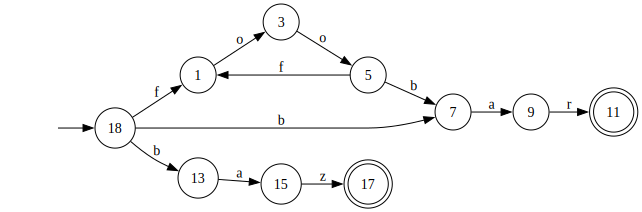

[](https://github.com/tkarabela/regex-automata/actions)
[](https://app.codecov.io/github/tkarabela/regex-automata)
[](https://github.com/tkarabela/regex-automata/actions)

# regex-automata

A toy implementation of regular expressions using finite automata.

## Usage

```python
import regex_automata

pattern = regex_automata.compile(r"(foo)*bar|baz")  # regex_automata.Pattern

pattern.fullmatch("foofoobar")  # regex_automata.Match(...)
pattern.fullmatch("foo")  # None

pattern.ast  # regex_automata.parser.ast.AstNode
pattern.nfa  # regex_automata.automata.nfa.NFA

pattern.render_ast("regex_ast.svg")
pattern.render_nfa("regex_nfa.svg")
```

Abstract syntax tree of `(foo)*bar|baz`:


Finite automaton accepting `(foo)*bar|baz`:



## Grammar

The recursive descent parser uses the following LL(1) grammar:

```
 1.  E  → F E'
 2.  E' → | E
 3.  E' → ε
 4.  F  → G F'
 5.  F' → G F'
 6.  F' → ε
 7.  G  → H G'
 8.  G' → *
 9.  G' → ε
10.  H  → ( E )
11.  H  → a
```

Which is derived from the following CFG:

```
E → F | E
E → F
F → G F
F → G
G → H *
G → H
H → ( E )
H → a
```

Which is derived from the following CFG:

```
E → E | E
E → E E
E → E *
E → ( E )
E → a
```

## License

MIT, see [LICENSE.txt](./LICENSE.txt).
